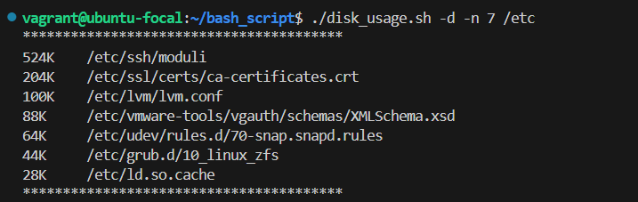
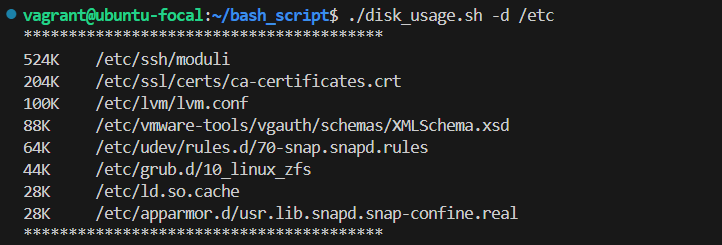
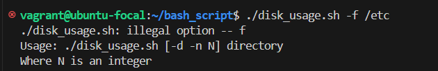
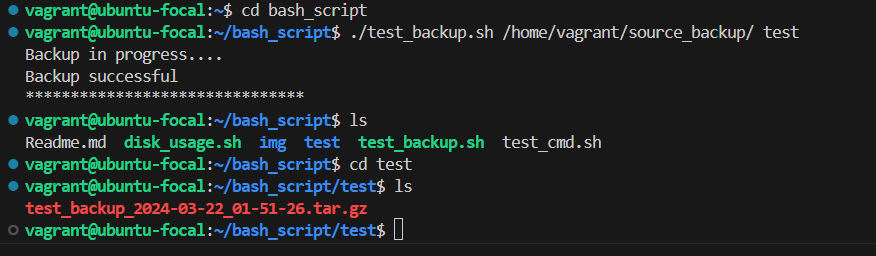

# TASK 1 - Write a shell script that checks the disk usage in a given directory:
* The script can take two optional arguments and one compulsory argument...
* -d: Which means that all files and directory within the specified directory or directories should be listed.
* -n: Which means that the top N enteries should be returned. Where N is an integer.
* List of directories: This will be the directories you want to check it's disk usage

> e.g: ` yourscript.sh -d -n 10 /etc ` should return the top 10 files & directories disk usage in /etc directory

> Note: When the -n argument is not given your script -`yourscript.sh -d /etc` will return the default top 8 files & directories disk usage in /etc directory

## SOLUTION:
```
#!/bin/bash

# define variables
display_files=false
default_entries=8
optstrings="dn:"

#help function
help() {
    echo "Usage: $0 [-d -n N] directory"
    echo "Where N is an integer"
}

#case statment for various options and arguments
while getopts "${optstrings}" opt;
do 
    case $opt in 
        d) 
          show_files=true
        ;;
        n) 
          default_entries=$OPTARG
        ;;
        \?) 
          help
        ;;
    esac
done

shift "$((OPTIND - 1))"

#loop through different directories and default_entries
for dir in "$@"; do
    if [ ! -d $dir ]; then
        echo "***********************************"
        echo "$dir is not a valid directory"
        continue
    fi

    if [ $display_files=true ]; then
        out_put=$(sudo find "$dir" -type f -exec du -Sh {} + | sort -rh | head -n "$default_entries")
    else 
        out_put=$(du -h "$dir" 2>/dev/null | sort -rh | head -n "$default_entries")

    fi

    echo "****************************************"
    echo "$out_put"
    echo "****************************************"

done
```
### RESULT:
`./disk_usage.sh -d -n 7 /etc`



`./disk_usage.sh -d /etc`



`./disk_usage.sh -f /etc`



# TASK 2 - Create a backup script. 
* This script creates a backup of a given directory and saves it in another directory with a timestamp. It takes two arguments: the source directory and the destination directory.

>Note: The backup shoud be a TAR archive.

>e.g ` ./yourscript.sh source_directory/ destination_directory ` should backup the contents of the source_directory saving the files into destination_directory, and coverting them into a tar archive format.

## SOLUTION:

```
#!/bin/bash

#Define variables for arguments passed
src=$1
destination=$2

#create time stamp
timestamp=$(date +"%Y-%m-%d_%H-%M-%S")

#Check if source argument passed is a directory
if [ -z $src ]; then
    echo "Usage: $0 <source_directory> <destination_directory>"
    exit 1
elif [ ! -d $src ]; then
    echo " <$1> not a valid directory"
    exit 1
fi

#Create destination directory if it doesn't exist
if [ ! -d $destination ]; then
    mkdir -p "$destination"
fi

echo "Backup in progress...."

sleep 3

tar -czf "$destination/$2_backup_$timestamp.tar.gz" "$src" 2>/dev/null

echo "Backup successful"

echo "*******************************"
```

### RESULT:
`./test_backup.sh  `




