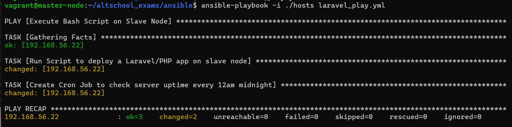
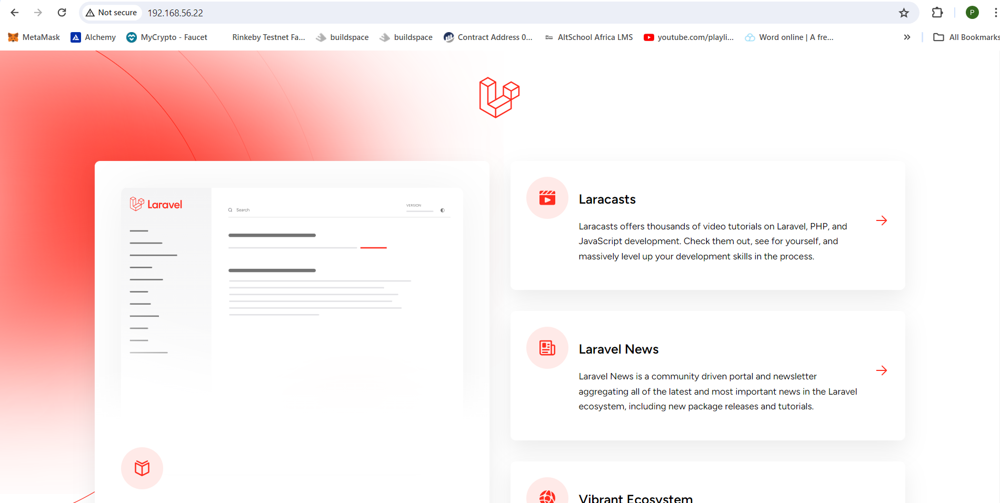
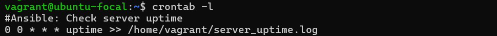

(Deploy LAMP Stack)

# OBJECTIVE

* Automate the provisioning of two Ubuntu-based servers, named “Master” and “Slave”, using Vagrant.
* On the Master node, create a bash script to automate the deployment of a LAMP (Linux, Apache, MySQL, PHP) stack.
* This script should clone a PHP application from GitHub, install all necessary packages, and configure Apache web server and MySQL. 
* Ensure the bash script is reusable and readable.

*Using an Ansible playbook:*

* Execute the bash script on the Slave node and verify that the PHP application is accessible through the VM’s IP address (take screenshot of this as evidence)
* Create a cron job to check the server’s uptime every 12 am.
Requirements

https://github.com/laravel/laravel

## SOLUTION
### Automate provisioning of two Ubuntu_based servers 
The first step is to provision two Ubuntu-based servers, named "Master and Slave".
I did this by editing a vagarant file to make provisons for two servers.
```
# -*- mode: ruby -*-
# vi: set ft=ruby :


Vagrant.configure("2") do |config|
  # Debian 10 VM
  config.vm.define "debian" do |debian|
    debian.vm.box = "debian/buster64"
    debian.vm.hostname = "slave"
    debian.vm.network "private_network", type: "dhcp"
    debian.vm.network "forwarded_port", guest: 80, host: 8081
  end

  # Ubuntu 20.04 VM
  config.vm.define "master" do |master|
    master.vm.box = "ubuntu/focal64"
    master.vm.hostname = "master"
    master.vm.network "private_network", type: "dhcp"
    master.vm.network "forwarded_port", guest: 80, host: 8080, auto_correct: true
  end

end

```
After this , with the command `vagrant up` and  `vagrant ssh master`. This gives me SSH access into the master server. 

### Create a Bash Script to automate the deployment of a LAMP (Linux, Apache, MySQL, PHP) stack:

Next step is to write a bash script that deploys my LAMP stack.

The first part of my bash script is where I declare the variables to be used later in the script to configure the database.

```
#!/bin/bash

#define variables
DB_CONNECTION="mysql"
DB_HOST="127.0.0.1"
DB_PORT="3306"
DB_DATABASE="laravel"
DB_USERNAME="praise"
DB_PASSWORD="password"

```

Then I installed apache2 webserver with this script

```
# Update package lists
sudo apt update

#install apache2
sudo apt install -y apache2
```

After this I added the script to install PHP and its dependencies.

```
# Update package lists
sudo apt update

#Install php
sudo apt install -y php8.2
sudo apt install -y php8.2-curl php8.2-dom php8.2-mbstring php8.2-xml php8.2-mysql zip unzip
```
This part of the script restarts the apache module so changes can be implemented.

```
#rewrite apache module
sudo a2enmod rewrite
sudo systemctl restart apache2
```

Here I installed composer in `/usr/bin` where executable files are stored.
```
#change directory
cd /usr/bin

#install composer
sudo curl -sS https://getcomposer.org/installer | sudo php -q
sudo mv composer.phar composer
```
This is the point in the script where I clone the laravel github repository in the apache default site directory, and changed its ownership to the apache default user. I also installed the composer auto loader in the laravel directory. This helps with dependency management for PHP

```
cd /var/www/
# Clone the PHP Git repository
sudo git clone https://github.com/laravel/laravel.git
sudo chown -R root laravel

#install autoloader
cd /var/www/laravel
sudo composer install --no-interaction --optimize-autoloader --no-dev
sudo composer update --no-interaction
```
Here I setup the staging environment by creating a `.env` file using contents from the `.env.example`. I also also generate a key for the data base. Using conditionals and the `sed` command I am able to append my desired variables into the staging environment.

```
#setup staging environment
sudo cp .env.example .env
sudo php artisan key:generate
sudo chown -R www-data storage
sudo chown -R www-data bootstrap/cache


# Check if the .env file exists
if [ -f ".env" ]; then
    # Uncomment and update database configuration
    sudo sed -i "s/^#* *\(DB_CONNECTION=\).*/\1${DB_CONNECTION}/" .env
    sudo sed -i "s/^#* *\(DB_HOST=\).*/\1${DB_HOST}/" .env
    sudo sed -i "s/^#* *\(DB_PORT=\).*/\1${DB_PORT}/" .env
    sudo sed -i "s/^#* *\(DB_DATABASE=\).*/\1${DB_DATABASE}/" .env
    sudo sed -i "s/^#* *\(DB_USERNAME=\).*/\1${DB_USERNAME}/" .env
    sudo sed -i "s/^#* *\(DB_PASSWORD=\).*/\1${DB_PASSWORD}/" .env
    
    echo "Database configuration updated in .env file"
else
    echo ".env file not found. Please create one."
fi
```
The next thing is to create an apache site configuration for the laravel application. I also input the command to disable the apache default site and enable the laravel site.

```
# Create a virtual host configuration file for Apache
sudo bash -c 'cat <<EOF > /etc/apache2/sites-available/mylaravelapp.conf
<VirtualHost *:80>
    ServerAdmin webmaster@localhost
    DocumentRoot /var/www/laravel/public

    <Directory /var/www/laravel>
        Options Indexes FollowSymLinks MultiViews
        AllowOverride All
        Order allow,deny
        allow from all
    </Directory>

    ErrorLog ${APACHE_LOG_DIR}/error.log
    CustomLog ${APACHE_LOG_DIR}/access.log combined
</VirtualHost>
EOF'

#disable apache default site
sudo a2dissite 000-default

# Enable the virtual host
sudo a2ensite mylaravelapp.conf
sudo systemctl restart apache2
```
The penultimate step is to install MySQL, after which a new user and database is created then privileges given to the user to access the database. This information is the same information used to setup the  the staging environment.

```
#install mysql
sudo apt install -y mysql-server

sudo apt install mysql-client
sudo systemctl start mysql

#update database with MySQL commands
sudo mysql -uroot -e "CREATE DATABASE ${DB_DATABASE};"
sudo mysql -uroot -e "CREATE USER '${DB_USERNAME}'@'localhost' IDENTIFIED BY '${DB_PASSWORD}';"
sudo mysql -uroot -e "GRANT ALL PRIVILEGES ON ${DB_DATABASE} . * TO '${DB_USERNAME}'@'localhost';"
sudo mysql -uroot -e "FLUSH PRIVILEGES;"
```
Finally I run the commands for database migrations and database seeding. Then I start the apache service.

```
sudo systemctl restart apache2


echo "Checking the status of the services"

echo Apache service is $(systemctl show -p ActiveState --value apache2)
echo MySQL service is $(systemctl show -p ActiveState --value mysql)

```
### Ansible
_Execute bash script on slave node:_

This bash script is meant to render a laravel application on the ip address of the slave node after it has been executed.

First thing is to set up the ansible environment.
I do this by creating an ansible folder and running the command `sudo apt install ansible`
Then I create an ansible configuration file `ansible.cfg` which is populated as shown below.

```
[defaults]
roles = os.path.join(os.path.dirname(__file__), 'roles')
inventory = hosts
remost_user = vagrant
host_key_checking = false

[privilege_escalations]
become = true
become_method = sudo
become_user = root
become_ack_password = false
```
An Inventory file is also created named `hosts` which includes the IP address of the slave node.

```
[webservers]
192.168.56.22
```
Next, I have to connect into the slave node through the master node. To do that I have to copy the public key of the master node into the `authorized_keys` file of the slave node.

In the server of the slave node I will edit the file `/etc/ssh/ssh.config.d` to set `Pubkyauthentication yes` and `Passwordauthentication yes`. In the master node server, I will run the command `ssh-copy-id vagrant@192.168.56.22`. This will copy the Publickey of the master server into the slave node. This gives the master ssh connection into the slave.

Finally a playbook is created to execute the bash script on the slave node. I use the script module.

```
---
- name: Execute Bash Script on Slave Node
  hosts: webservers
  become: true
  tasks:
    - name: Run Script to deploy a Laravel/PHP app on slave node
      script: /home/vagrant/altschool_exams/my_laravel_app.sh

```
_Create a cron job to check the server’s uptime every 12 am._

Here I add another task in the playbook that executed a cron job at 12am midnight. This cron job checks the server uptime and saves it into a log file.

```
---

- name: Cron Job to check server up time
  hosts: webservers
  tasks:
    - name: Create Cron Job to check server uptime every 12am midnight
      cron:
        name: "Check server uptime"
        minute: "0"
        hour: "0"
        job: "uptime >> /home/vagrant/server_uptime.log"

```

The laravel app will be rendered to the IP address of the slave node after I run the ansible command `ansible-palybook -i ./hosts larave_play.yml`. 






I can also confirm is my cronjob worked in my slave node but running `crontab -l` in the slave node.




